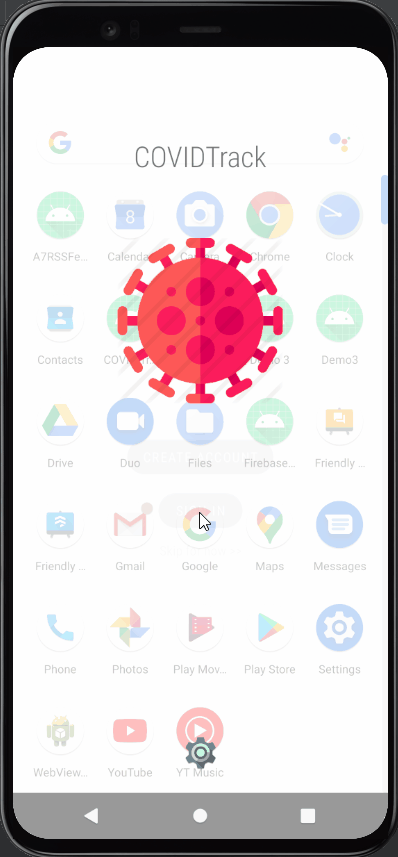
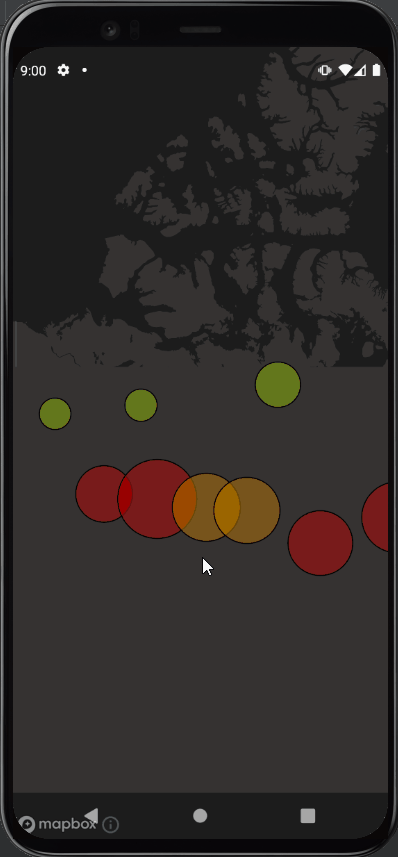
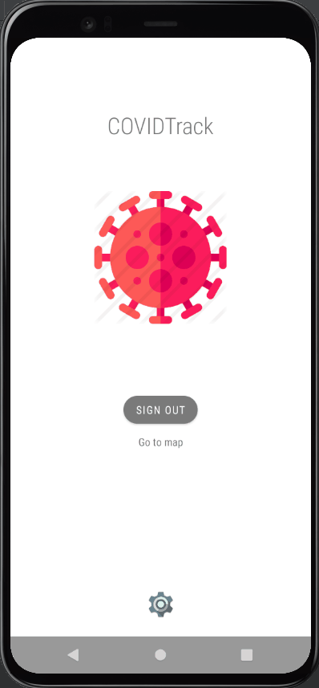

<h1 align="center">COVIDTrack</h1>

<h4 align="center">Access and view data-visualized Canadian COVID-19 statistics using your Android mobile device.</h4>

---

# Features

- COVID-19 data consumed from public API and visualized on a interactive map for mobile devices
- Interactive map 
  - each province includes case count, deaths, recoveries and vaccination count
- Visualized provincial COVID-19 data
  - clusters colour-coded to identify the total number of COVID-19 cases to date
  - clusters range in size to represent the ratio of COVID-19 cases to population count
- Population vaccination percentage represented by an easy to visualize progression bar
- User account creation & login
  - Login authentication via Firebase authentication
  - Save current location for contact tracing purposes
  - Data stored to a Firebase back-end
- Accessibility settings to accommodate colour-blindness

---

<h3 align="center">Home Screen</h3>

<h3 align="center">Map Interaction</h3>

<h3 align="center">Accessibility & Current Location Tracking</h3>

